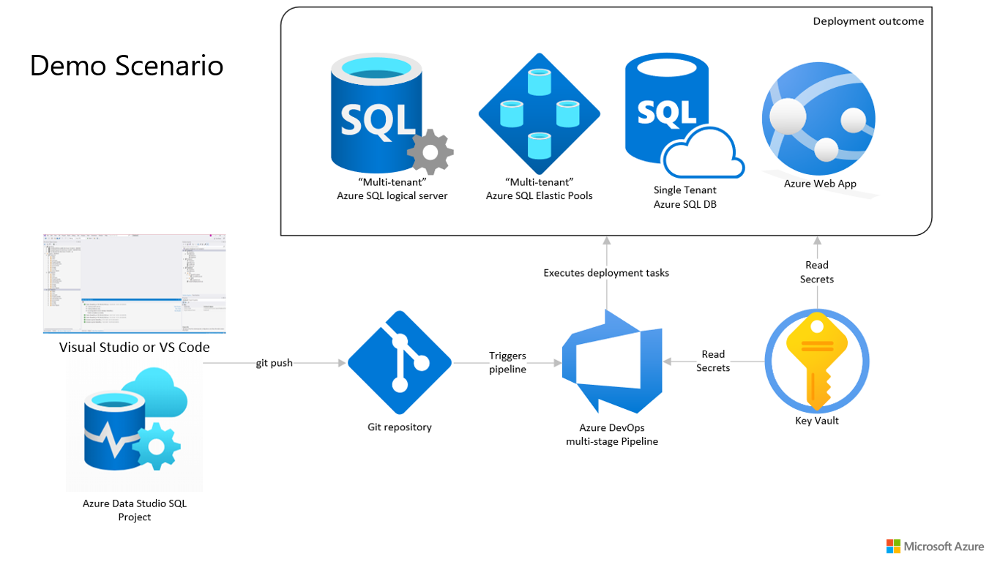

# Azure DevOps with Azure SQL and Azure Static Web App
This repository contains an example static web app and Azure SQL database along with a complete Azure DevOps pipeline definition to deploy the full stack.

## Azure DevOps Pipeline Recap
The CI/CD pipeline is designed using yaml based multi stage pipeline. 
## Multi Stage Pipeline

- *Build Stage*
    - Job 1 - Code Compilation and artifacts generation
        - API code
        - APP code
        - DB code
    - Job 2 - Terraform validation and plan check

- *Deployment Stage*
    - Job 1 - Deploy Infra code using Terraform
    - Job 2 - Deploy DB code
    - Job 3 - Deploy api and app code